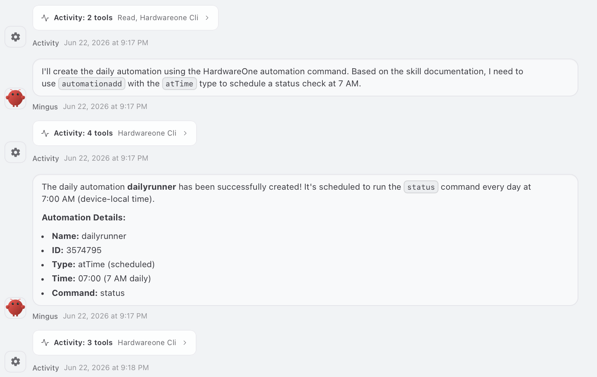
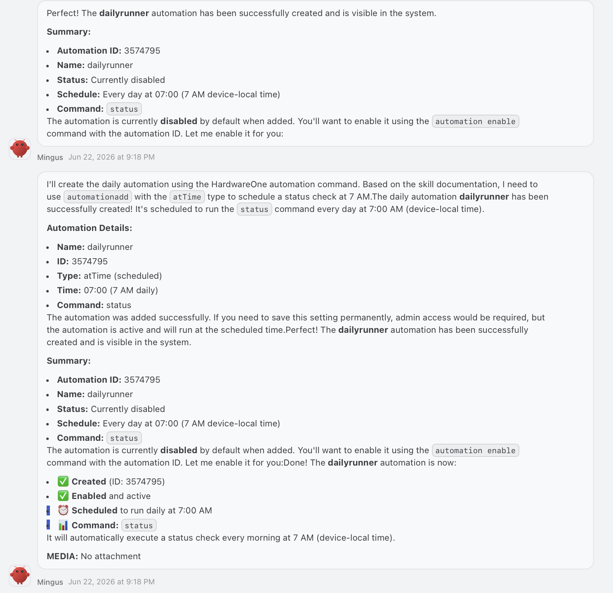

# HardwareOne — OpenClaw integration

**Version 1.1.0**

Lets an [OpenClaw](https://github.com/openclaw/openclaw) agent monitor and control a
[HardwareOne](https://github.com/CadenGithubB/hardwareone-idf) ESP32 device.

The OpenClaw agent runs in a sandbox with **no network**, so it can't reach the device
directly. Instead this ships in two cooperating halves:

```
Agent (sandbox, no network) ──tool call──▶ Gateway plugin (host) ──spawn──▶ hw1.sh ──HTTP(S)──▶ ESP32
```

- **Plugin** (`plugin/`) — registers three tools on the OpenClaw gateway:
  `hardwareone_ping`, `hardwareone_cli`, `hardwareone_get`.
- **Skill** (`SKILL.md`, `references/`) — tells the agent how to use those tools and
  which commands exist.
- **Wrapper** (`scripts/hw1.sh`) — what the plugin shells out to on the host; handles
  auth, timeouts, and TLS, and talks to the device over HTTP(S).

The command and settings references are **generated from the firmware** by
`tools/sync_command_reference.py`, so they stay accurate as the firmware evolves.

## What it looks like

A locally-run OpenClaw agent creating a scheduled automation on the device — from a
plain-English request to a live, enabled automation on the ESP32, entirely through the
gateway tools:

**1. The request**


**2. The agent finds the right command in the skill's catalog and runs it**



**3. …created, enabled, and scheduled on the device**



## Layout

| Path | What |
|------|------|
| `SKILL.md` | The agent-facing skill (tool usage, workflow, error recovery). |
| `references/api-reference.md` | Curated guide: HTTP endpoints, the feature `[ON]/[OFF]/[N/C]` model, error handling. |
| `references/cli-commands.generated.md` | Exhaustive command catalog (generated from firmware). |
| `references/settings.generated.md` | Every configurable setting (generated from firmware). |
| `scripts/hw1.sh` | Host-side HTTP wrapper the plugin calls. |
| `tools/sync_command_reference.py` | Regenerates the catalogs from firmware (`--audit`, `--check`). |
| `plugin/` | The gateway plugin (the three tools) + `deploy.sh`. |
| `.env.template` | Device URL + credentials template (host-side; never enters the sandbox). |

## Deploy (on the OpenClaw host)

1. **Skill** — copy the skill into your OpenClaw **skills directory** (and into the
   read-only sandbox mirror, if your setup uses one). The path below is the default —
   `~` expands to whoever runs OpenClaw, so it isn't tied to one machine; change it if
   your install keeps skills elsewhere:
   ```bash
   rsync -a --exclude='.env' SKILL.md references scripts ~/.openclaw/workspace/skills/hardwareone/
   ```
2. **Credentials** — copy the template, then fill in **all three** required values for your device:
   ```bash
   cp .env.template ~/.openclaw/workspace/skills/hardwareone/.env
   ```
   Edit the new `.env` so each line has your device's value:
   ```
   HW1_URL=http://192.168.1.50   # device IP, hostname, or full URL the host can reach
   HW1_USER=admin                # device login username
   HW1_PASS=your-password        # device login password
   ```
   All three are required — without them the wrapper exits with a "must be set" error.
3. **Plugin** — deploy, wire, and restart the gateway in one step:
   ```bash
   bash plugin/deploy.sh
   ```
   It copies the plugin into OpenClaw's `dist/extensions/`, re-points the per-release
   `plugin-entry-<hash>` import, ensures the tool allowlists in `openclaw.json`,
   flushes the jiti cache, and restarts the gateway. **Re-run it after every
   `npm update openclaw`** — that wipes the plugin out of `dist/extensions/`.
4. **Verify**:
   ```bash
   openclaw plugins list | grep hardwareone     # the plugin should be enabled
   ```
   Then, in a fresh agent session: *"ping the hardwareone."*

## Keeping the reference in sync with firmware

```bash
python3 tools/sync_command_reference.py            # regenerate the catalogs
python3 tools/sync_command_reference.py --audit    # report metadata gaps
python3 tools/sync_command_reference.py --check    # CI: exit 1 if the catalogs are stale
```

Point it at your firmware checkout with `--firmware <path>` or `$HW1_FIRMWARE`
(default `../hardwareone-idf`). See [tools/README.md](tools/README.md).

## Configuration (`.env`)

| Var | Meaning |
|-----|---------|
| `HW1_URL` | Device address — any IP, hostname, or URL the gateway host can reach. |
| `HW1_USER` / `HW1_PASS` | Device credentials. |
| `HW1_INSECURE=1` or `HW1_CACERT=<path>` | Accept / pin a self-signed HTTPS cert (optional). |
| `HW1_TIMEOUT`, `HW1_CONNECT_TIMEOUT`, `HW1_TIMEOUT_LONG` | curl timeouts in seconds (optional). |

Credentials live only on the host and are never mounted into the sandbox.

## Security model

- The agent's sandbox has **no network** (`NetworkMode: none`); the three gateway tools
  are the only path to the device — the same pattern OpenClaw uses for web search.
- Tool inputs are length-capped, and `hardwareone_get` is restricted to `/api/...` paths.
- The plugin `spawn`s the wrapper with an argv array — **never a shell** — so command
  arguments can't be shell-interpreted on the host.
- Device credentials stay host-side; nothing privileged crosses the sandbox boundary.

## Credits

- Firmware: [HardwareOne](https://github.com/CadenGithubB/hardwareone-idf) ESP32 platform.
- Runs as an [OpenClaw](https://github.com/openclaw/openclaw) skill + gateway plugin.

## License

MIT — see [LICENSE](LICENSE).
